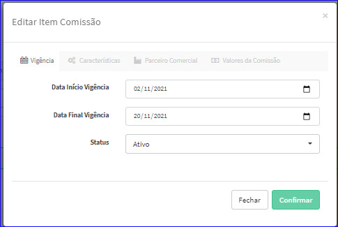
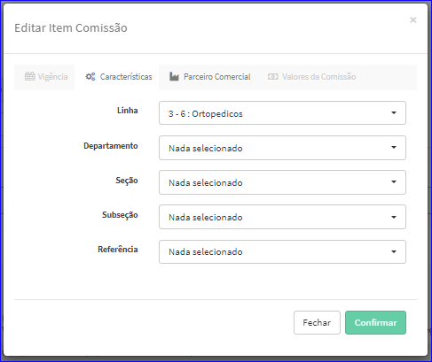

Editar Item Comissão
####################
- A tela da Edição permite alterar os dados de um Item da Comissão, Incluir, Alterar e Excluir Valores do item.

- Esta tela é chamada através da Lista de Itens da Comissão exibida na tela de Edição da Comissão.
- Para isso, baste selecionar um Item da Lista e ir até a Engrenagem situada à direita e escolher a opção **Editar Item Comissão**.

|imagem19|

- Após, o sistema irá abrir uma nova janela com os dados do Item selecionado.

- **Vigência**

|imagem20|

- **Características**

|imagem21|

- **Parceiro Comercial**

|Imagem22|

- **Valores da Comissão**
   * Exemplo de Item sem Valores adicionados.
   
|imagem16|

   * Exemplo de Item com Valores adicionados.
   
|imagem23|

- Após efetuadas as alterações e clidao em **Confirmar**, o sistema fechará a janela da Edição e atualizará a tela da Edição da Comissão.

.. toctree::
    :maxdepth: 2

    inserir_valor

.. |br| raw:: html

    

.. |imagem16| image:: imagens/Item_Valores.png

.. |imagem19| image:: imagens/Editar_Comissao_Itens_2.png

.. |imagem22| image:: imagens/Editar_Comissao_Itens_5.png

.. |imagem23| image:: imagens/Valor_Lista.png
