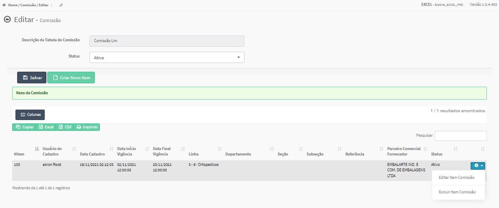

Editar Item  Comissão
#####################
- A tela da Edição permite alterar os dados de um Item da Comissão, Incluir, Alterar e Excluir Valores do item.

- Esta tela é chamada através da Lista de Itens da Comissão exibida na tela de Edição da Comissão.
- Para isso, baste selecionar um Item da Lista e ir até a Engrenagem situada à direita e escolher a opção **Editar Item Comissão**.

|imagem19|

`Cadastro de Comissões`_

- A funcionalidade permite gerar um novo código de Comissão.

|imagem3|
   * O sistema valida a descrição informada pelo usuário.
   * Caso não for informada descrição ou informada menos de 2 caracteres, é exibida a mensagem.

|imagem4|
   * Após informado corretamente uma descrição, o sistema automaticamente abrirá a tela de `Editar Comissão`_.

---------------
Editar Comissão
---------------
- A tela da Edição permite alterar o Status e/ou `Criar Novo Item`_ para uma Comissão.

|imagem5|
- O Botão SALVAR irá atualizar o Status da Comissão, a Descrição não poderá ser alterada.

----------------
Excluir Comissão
----------------
- Ao selecionar um item da Lista, o sistema permite Excluir a Comissão, desde que **NÃO** esteja em Período de Vigência Ativo.

|imagem8|
   * Após excluída uma Comissão, a lista automaticamente será atualizada.

---------------
Criar Novo Item
---------------
- Esta funcionalidade permite o Usuário inserir um Item para uma determinada Comissão onde definirá:
   * Período de Vigência;

|imagem12|
   * A Data Início da Vigência é obrigatória.
   
   
   - Características;
   
|imagem13|      
   * Caso não tenha sido informada nenhuma Característica, o sistema apresentará uma mensagem de advertência.
      
|imagem15|
   
   - Parceiro Comercial;
   
|imagem14|

   - Valores da Comissão (`Inserir Valor`_). 
      + *Observações:* Os valores apenas serão inseridos no Item após a criação do mesmo.

- Após a Inserção do Item, o sistema atualizará a página da Edição da Comissão e mostrará uma Lista com os seus respectivos Itens.

|imagem17|
   * `Funções da Lista`_.

-------------
Inserir Valor
-------------
- Permite a Inserção de um ou mais valores para um Item da Comissão.

|imagem16|
   * Ao Clicar em **+ Inserir Valor**, o sistema abrirá uma tela para informar os dados.
   
|imagem18|

----------------
Funções da Lista
----------------

Colunas da Lista
----------------
- A opção Colunas da Lista permite que o usuário escolha as colunas que serão exibidas.
- Permite também efetuar uma Pesquisa peno nome das colunas.

|imagem6|

Impressão dos Resultados
------------------------
- Copiar:
   * Permite Copiar os dados dos Item(ns);
- Excel:
   * Gera uma Planilha;
- CSV:
   * Gera uma Planilha;
-Imprimir:
   * Gera um Relatório.
   
|imagem7|

-------------
Menu Superior
-------------

|imagem9|

-------------
Menu Esquerdo
-------------
|imagem10|

.. toctree::
    :maxdepth: 2

    cadastro_comissao/comissao

.. |br| raw:: html

    

.. |imagem1| image:: /docs/source/images/comissao_1.png

.. |imagem2| image:: /docs/source/images/comissao_2.png

.. |imagem3| image:: /docs/source/images/Criar_Comissao.png

.. |imagem4| image:: /docs/source/images/Criar_Comissao_2.png

.. |imagem5| image:: /docs/source/images/Editar_Comissao.png

.. |imagem6| image:: /docs/source/images/Comissao_Colunas.png

.. |imagem7| image:: /docs/source/images/Impressao_Resultados.png

.. |imagem8| image:: /docs/source/images/Excluir_Comissao.png

.. |imagem9| image:: /docs/source/images/Menu_Superior.png

.. |imagem10| image:: /docs/source/images/Menu_Esquerda.png

.. |imagem11| image:: /docs/source/images/Itens_Comissao.png

.. |imagem12| image:: /docs/source/images/Item_Vigencia.png

.. |imagem13| image:: /docs/source/images/Item_Caracteristicas.png

.. |imagem14| image:: /docs/source/images/Item_Parceiro_Comercial.png

.. |imagem15| image:: /docs/source/images/Item_Erro.png

.. |imagem16| image:: /docs/source/images/Item_Valores.png

.. |imagem17| image:: /docs/source/images/Editar_Comissao_Itens.png

.. |imagem18| image:: /docs/source/images/Valor_Criacao.png

