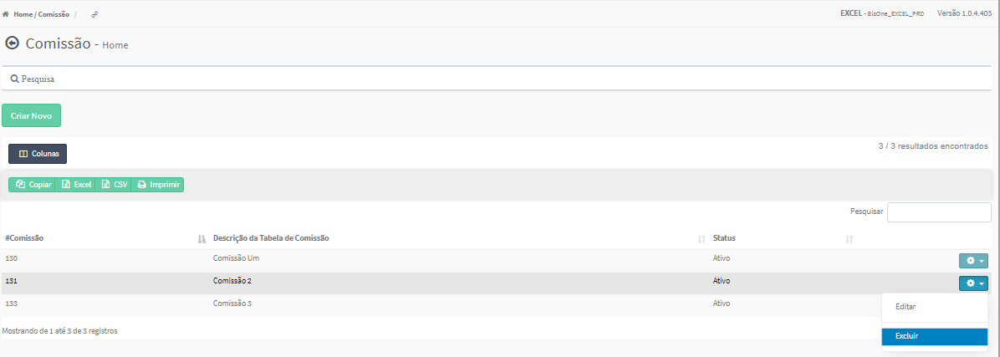

Excluir Comissão
################
   - A Exclusão da Comissão somente é permitida na Tela Principal do Cadastro.

   - Para efetivar a exlusão, o usuário deverá selecionar a Engrenagem que está no lado direito da Lista e escolher a opção EXCLUIR.
|imagem8|
   * Após excluída uma Comissão, a lista automaticamente será atualizada.

   - O sistema permite Excluir a Comissão desde que **NÃO** esteja em Período de Vigência Ativo.
     
   -- Caso o sistema verifique que a Vigência da Comissão está ativa, informará um erro ao usuário.
|imagem18|  

.. |br| raw:: html

    

.. |imagem18| image:: imagens/Comissao_erro.png
