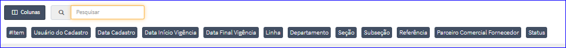

Funções Lista
#############

Colunas da Lista
----------------
- A opção Colunas da Lista permite que o usuário escolha as colunas que serão exibidas.
- Permite também efetuar uma Pesquisa peno nome das colunas.

|imagem1|

Impressão dos Resultados
------------------------
- Copiar:
   * Permite Copiar os dados dos Item(ns);
- Excel:
   * Gera uma Planilha;
- CSV:
   * Gera uma Planilha;
- Imprimir:
   * Gera um Relatório.
   
|imagem7|

