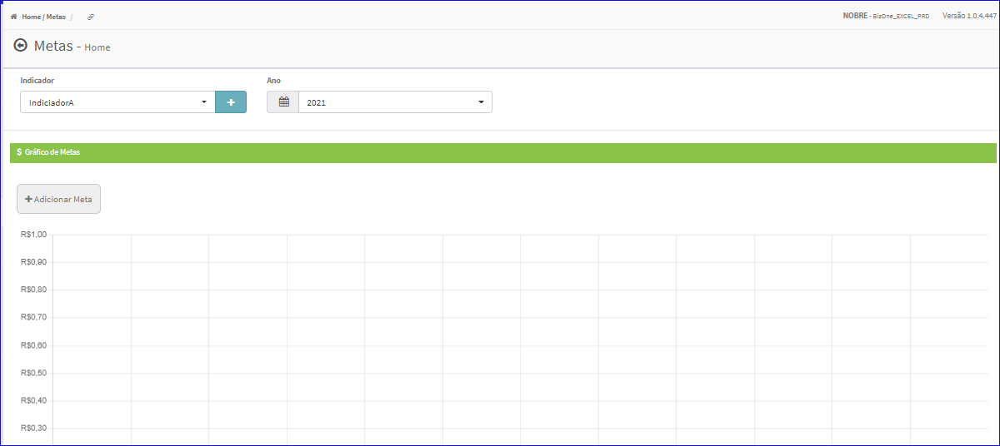
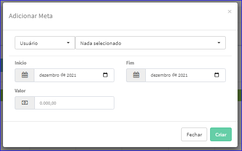
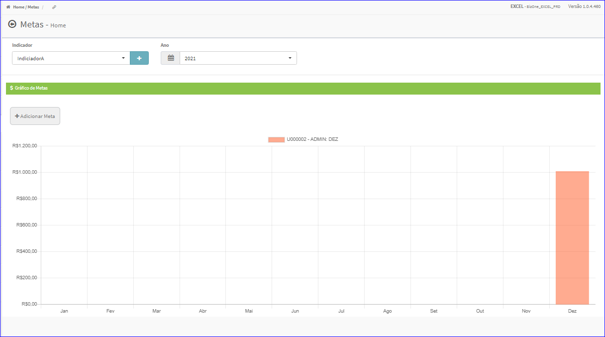

Criar Meta
##########
- Permite gerar uma nova Meta.

- Essa opção é chamada através do botão **Adicionar Meta** da tela principal do Cadastro de Metas.

|imagem2|

- Após clicar no botão, o sistema irá abrir uma nova tela para a criação do cadastro.

|imagem4|
   * Após informado corretamente o Usuário, Período e Valor e clicado em **Criar**, o sistema automaticamente atualizará o gráfico da tela com as Metas estabelecidas.

|imagem6|

   * Caso o usuário não informar corretamente os dados, o sistema mostrará a mensagem.

|imagem5|

.. |imagem5| image:: imagens/Metas_5.png

