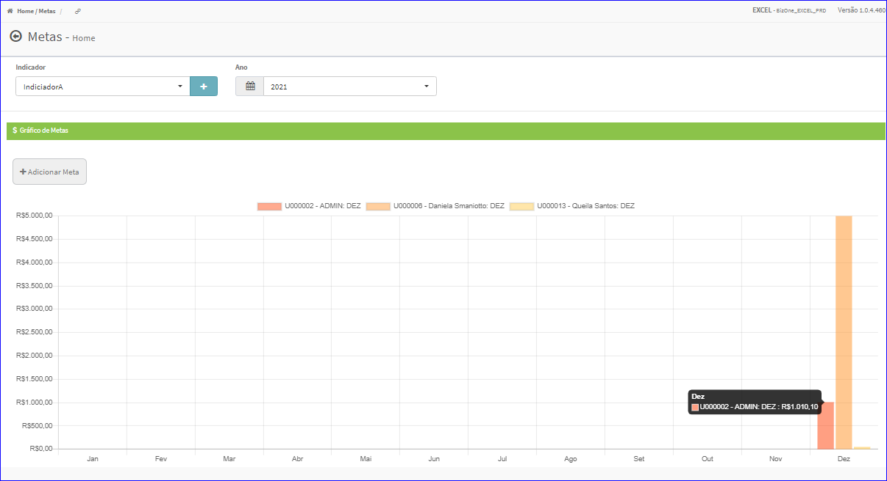
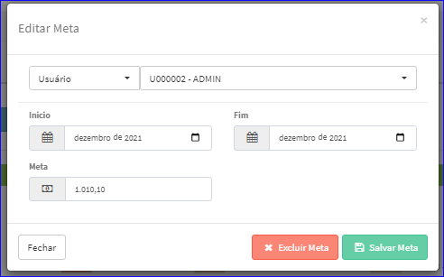

Excluir Meta
############
- A tela principal do Cadastro permite efetuar a exclusão de uma Meta.
- Para isso, basta selecionar uma Meta do Gráfico e clicar sob a mesma.

|imagem7|
   - Após o sistema irá abrir uma nova tela com a Meta escolhida anteriormente.   

|imagem8|
   - Após escolhido a Meta e clicado em ** Excluir Meta** o sistema irá questionar o usuário quanto ao registro.

|imagem9|
   - Depois de clicado em **Sim** o sistema atualizará o gráfico da tela.

.. |imagem9| image:: imagens/Metas_9.png
