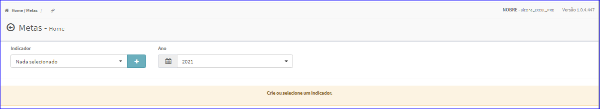

Metas
#####
No Menu (Superior ou Esquerdo) acesse a opção **Cadastros -> Metas**.
   * O sistema irá apresentar uma tela conforme exemplo abaixo.

|imagem1|

- Após a definição do Indicador, os resultados serão apresentados conforme exemplo.

|imagem2|

.. toctree::
   :maxdepth: 2

   criar_metas
   editar_metas
   excluir_metas

.. |imagem2| image:: imagens/Metas_2.png
