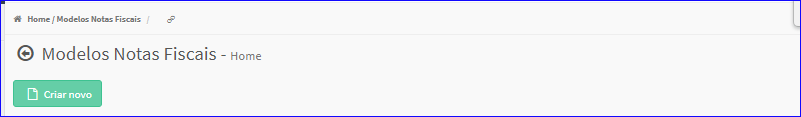
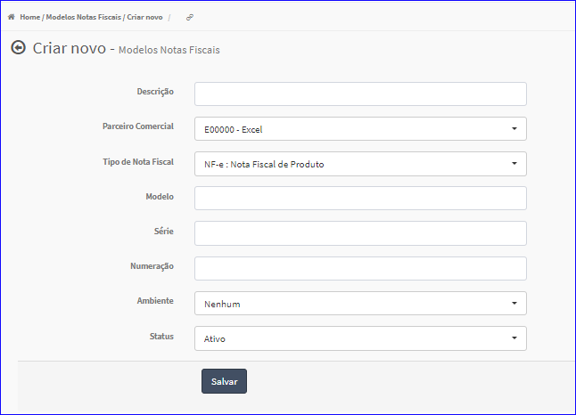
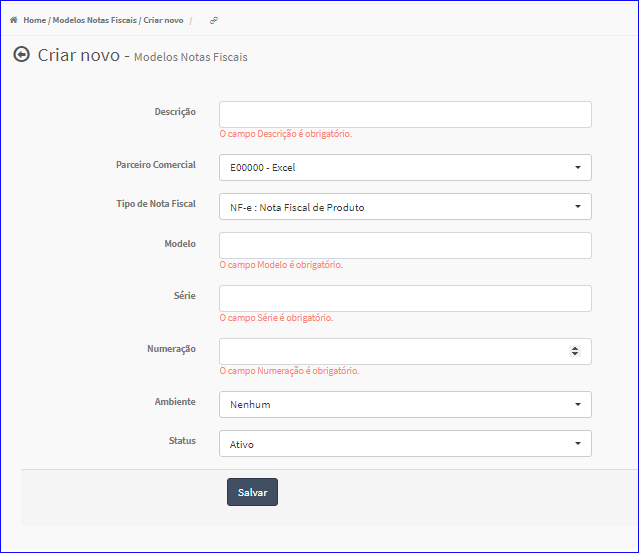

Criar Modelo
############
- Permite gerar um novo Modelo.

- Essa opção é chamada através do botão **Criar Novo** da tela principal do Cadastro de Modelos.

|imagem1|

- Após clicar no botão, o sistema irá abrir uma nova tela para a criação do cadastro.

|imagem5|
   * Após informado corretamente os dados e clicado em **Salvarr**, o sistema automaticamente atualizará a lista dos Modelos.

   * Caso o usuário não informar corretamente os dados, o sistema mostrará a mensagem.

|imagem6|

