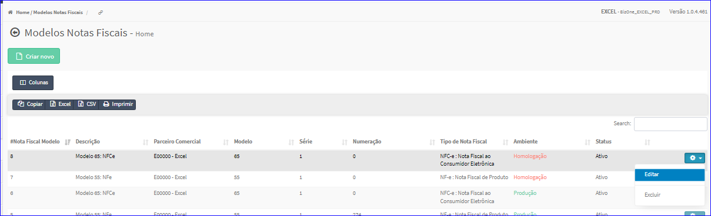
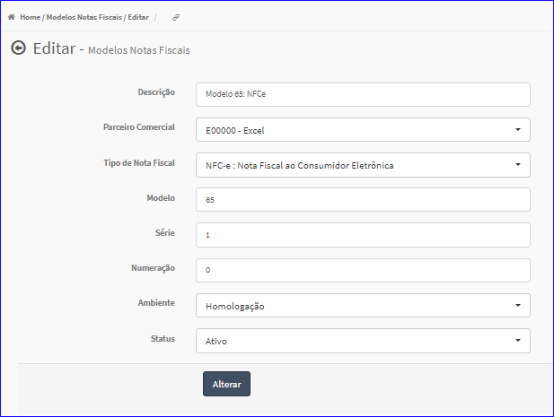

Editar Modelo
#############
- A tela da Edição permite alterar os dados de um Modelo.

- Esta tela é chamada através da Lista de Modelos exibida na tela principal do Cadastro.
- Para isso, basta selecionar um Modelo e ir até a Engrenagem situada à direita e escolher a opção **Editar**.

|imagem7|
   - `Funções da Lista <lista_modelos.html#section>`__
   - Após o sistema irá abrir uma nova tela com o Modelo escolhido anteriormente.   

|imagem8|

- Após alterados os dados e clicado em **Alterar**, o sistema atualizará a lista.

