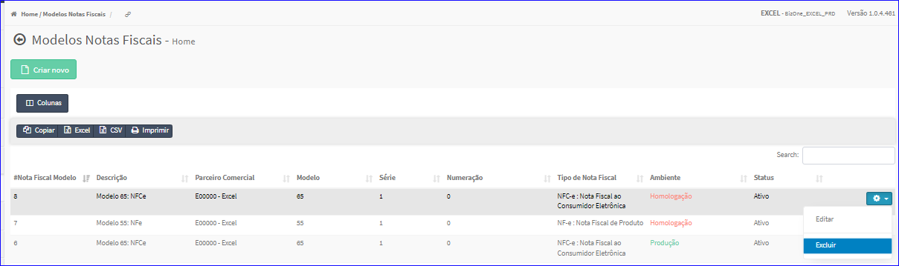
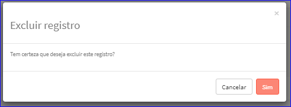

Excluir Modelo
##############
- Esta opção é chamada através da Lista dos Modelos exibida na tela principal do Cadastro.
- Para isso, basta selecionar um Modelo da Lista e ir até a Engrenagem situada à direita e escolher a opção **Excluir**.

|imagem9|
   - `Funções da Lista <lista_modelos.html#section>`__
   - Após escolhido o Modelo o sistema irá questionar o usuário quanto ao registro.

|imagem10|
   - Depois de clicado em **Sim** o sistema atualizará a lista.

