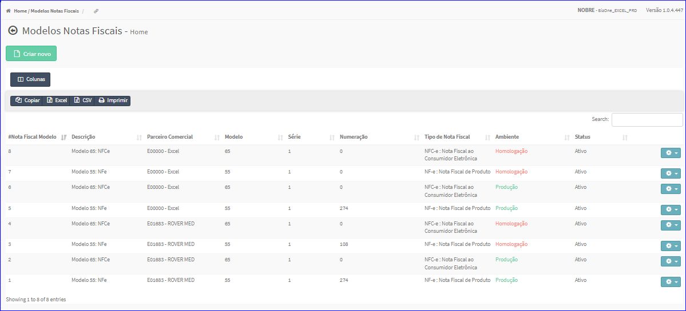

Modelos
#######
No Menu (Superior ou Esquerdo) acesse a opção **Cadastros -> Nota Fiscal -> Modelos**.
   * O sistema irá apresentar uma tela conforme exemplo abaixo.

|imagem1|
   * Tela sem nenhum modelo cadastrado.

|imagem2|
   - Tela com modelos cadastrados.
   - `Funções da Lista <lista_modelos.html#section>`__

.. toctree::
   :maxdepth: 2

   criar_modelos
   editar_modelos
   excluir_modelos

.. |imagem1| image:: imagens/Modelos_1.png

