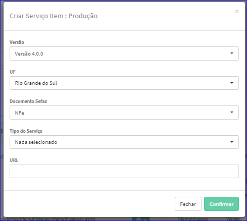
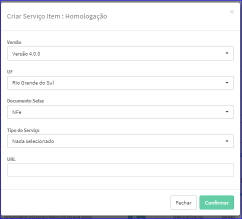

Criar Item Serviço
##################
- Esta tela é chamada através da Lista de Itens de Serviços exibida na tela de Edição do Serviço.

|imagem4|

- **Criar Item Serviço Produção**
   - Para isso, basta selecionar o botão **+** na aba Produção.
   - Após o sistema irá abrir uma nova tela para efetuar o cadastro.

|imagem9|

- Após informados os dados e clicado em **Confirmar**, o sistema atualizará a lista.

- **Criar Item Serviço Homologação**
   - Para isso, basta selecionar o botão **+** na aba Homologação.
   - Após o sistema irá abrir uma nova tela para efetuar o cadastro.

|imagem21|

- Após informados os dados e clicado em **Confirmar**, o sistema atualizará a lista.

.. |imagem4| image:: imagens/Servicos_4.png

