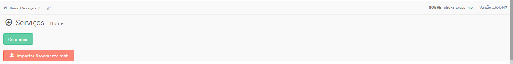
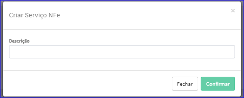
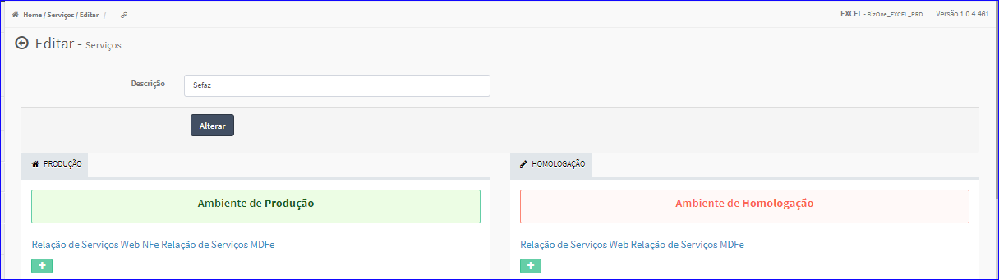

Criar Serviço
#############
- Permite gerar um novo Serviço.

- Essa opção é chamada através do botão **Criar Novo** da tela principal do Cadastro de Serviços.

|imagem1|

- Após clicar no botão, o sistema irá abrir uma nova tela para a criação do cadastro.

|imagem3|
   * Após informado corretamente os dados e clicado em **Confirmar**, o sistema automaticamente abrirá a tela da Edição do Serviço.

|imagem4|

