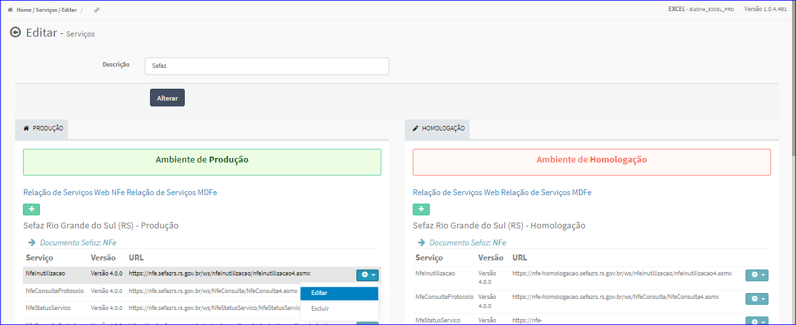
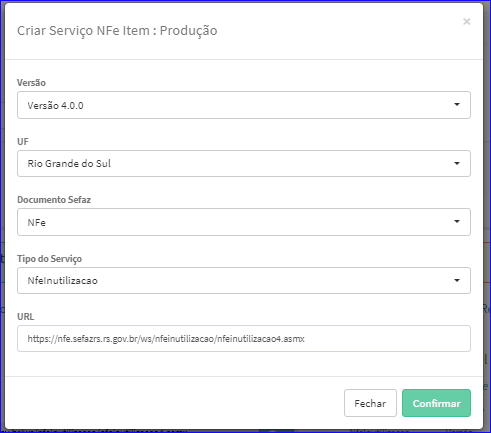
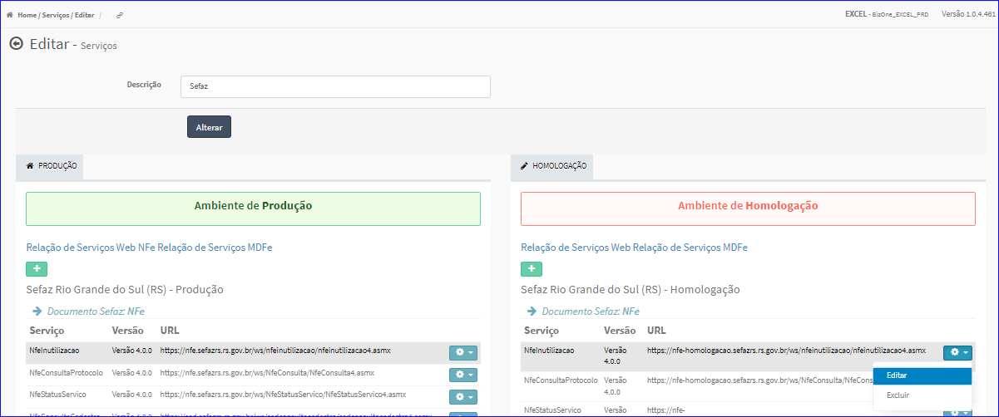
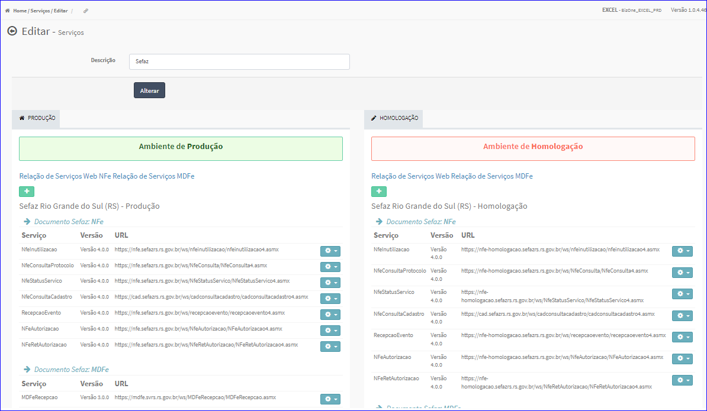

Editar Item Serviço
###################
- Esta tela é chamada através da Lista de Itens de Serviços exibida na tela de Edição do Serviço.

|imagem20|

- **Editar Item Serviço Produção**
   - Para isso, basta selecionar um Item e ir até a Engrenagem situada à direita e escolher a opção **Editar**.
   
|imagem10|
   - Após o sistema irá abrir uma nova tela para efetuar o cadastro.

|imagem11|

- Após informados os dados e clicado em **Confirmar**, o sistema atualizará a lista.

- **Editar Item Serviço Homologação**
   - Para isso, basta selecionar um Item e ir até a Engrenagem situada à direita e escolher a opção **Editar**.
   
|imagem14|
   - Após o sistema irá abrir uma nova tela para efetuar o cadastro.

|imagem15|

- Após informados os dados e clicado em **Confirmar**, o sistema atualizará a lista.

.. |imagem4| image:: imagens/Servicos_4.png

.. |imagem15| image:: imagens/Servicos_15.png

