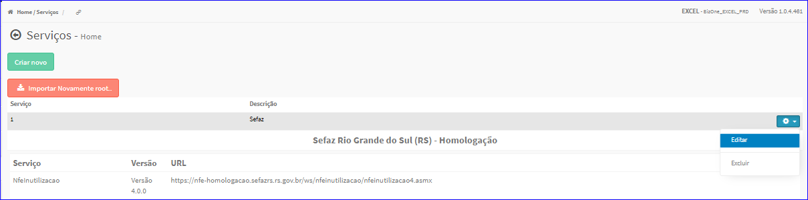

Editar Serviço
##############
- A tela da Edição permite alterar os dados de um Serviço.

- Esta tela é chamada através da Lista de Serviços exibida na tela principal do Cadastro.
- Para isso, basta selecionar um Serviço e ir até a Engrenagem situada à direita e escolher a opção **Editar**.

|imagem6|
   - Após o sistema irá abrir uma nova tela com o Serviço escolhido anteriormente.   

|imagem20|

- Após editados os dados e clicado em **Alterar**, o sistema atualizará a lista.

.. toctree::
   :maxdepth: 2

   itens_servicos

.. |imagem20| image:: imagens/Servicos_20.png
