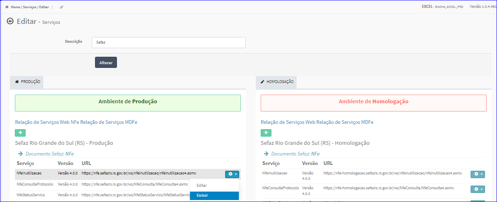
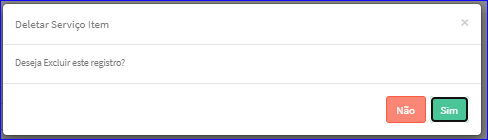
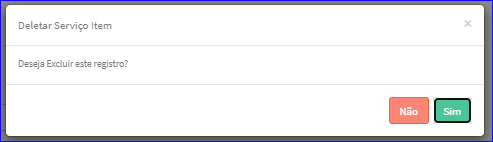

Excluir Item Serviço
####################
- Esta tela é chamada através da Lista de Itens de Serviços exibida na tela de Edição do Serviço.

|imagem20|

- **Excluir Item Serviço Produção**
   - Para isso, basta selecionar um Item e ir até a Engrenagem situada à direita e escolher a opção **Excluir**.
   
|imagem12|
   - Após escolhido o Item o sistema irá questionar o usuário quanto ao registro.

|imagem13|
   - Após clicado em **Sim**, o sistema atualizará a lista.

- **Excluir Item Serviço Homologação**
   - Para isso, basta selecionar um Item e ir até a Engrenagem situada à direita e escolher a opção **Excluir**.
   
|imagem16|
   - Após escolhido o Item o sistema irá questionar o usuário quanto ao registro.

|imagem17|
   - Após clicado em **Sim**, o sistema atualizará a lista.

.. |imagem4| image:: imagens/Servicos_4.png

.. |imagem16| image:: imagens/Servicos_16.png

