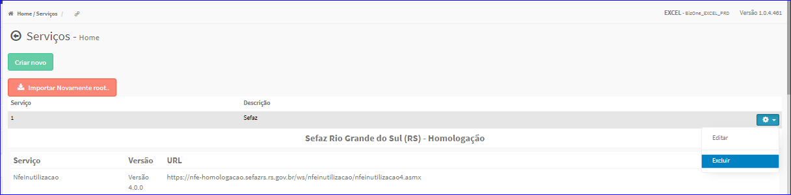
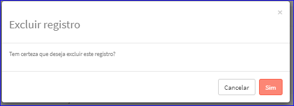

Excluir Serviço
###############
- Esta opção é chamada através da Lista dos Serviços exibida na tela principal do Cadastro.
- Para isso, basta selecionar um Serviço da Lista e ir até a Engrenagem situada à direita e escolher a opção **Excluir**.

|imagem18|
   - Após escolhido o Serviço o sistema irá questionar o usuário quanto ao registro.

|imagem19|
   - Depois de clicado em **Sim** o sistema atualizará a lista.

