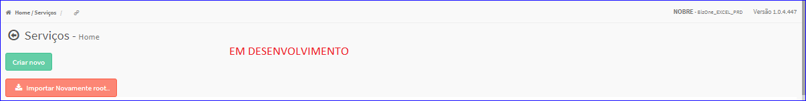

Importar Novamente Root
#######################
- Permite importar dados do Serviço.

- Essa opção é chamada através do botão **Importar Novamente root.** da tela principal do Cadastro de Serviços.

|imagem1|

|imagem1a|

.. |imagem1| image:: imagens/Servicos_1.png

