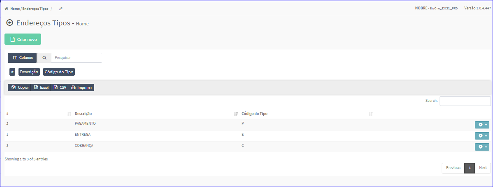
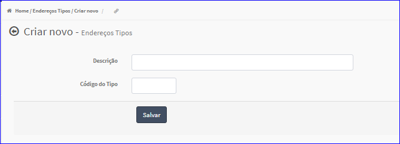
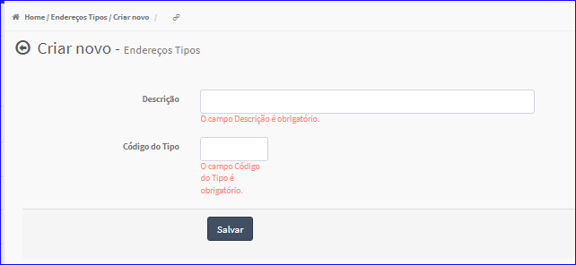

Criar Endereços Tipos
#####################
- Permite gerar um novo Tipo de Endereço.

- Essa opção é chamada através do botão **Criar Novo** da tela principal do Cadastro de Endereços Tipos.

|imagem4|

- Após clicar no botão, o sistema irá abrir uma nova tela para a criação do cadastro.

|imagem5|
   * O sistema valida os dados informados pelo usuário.
   * Caso não forem informados corretamente, são exibidas as mensagens.

|imagem10|
   * Após informado corretamente os dados e clicado em **Salvar**, o sistema automaticamente atualizará a Lista do Cadastro de Tipos de Endereço.

