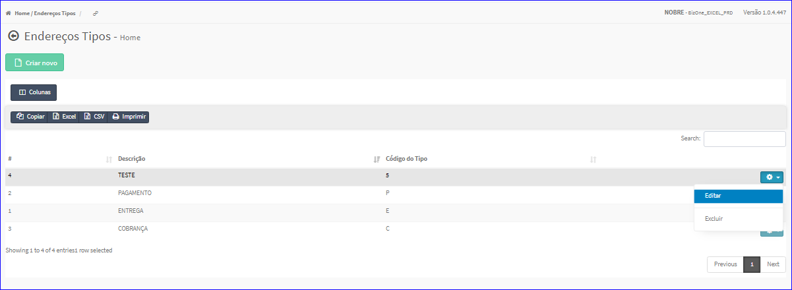
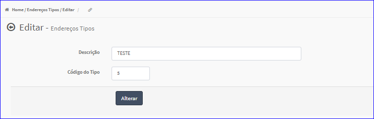

Editar Endereços Tipos
######################
- A tela do cadastro permite alterar os dados de um Tipo de Endereço.

- Esta tela é chamada através da Lista dos Tipos de Endereço exibida na tela principal do Cadastro.
- Para isso, basta selecionar um Tipo da Lista e ir até a Engrenagem situada à direita e escolher a opção **Editar**.

|imagem6|
   - `Funções da Lista <lista_enderecos_tipos.html#section>`__
   - Após o sistema irá abrir uma nova tela com o Tipo de Endereço escolhido anteriormente.   

|imagem7|
   - O botão **Alterar** irá atualizar todas as modificações efetuadas.

