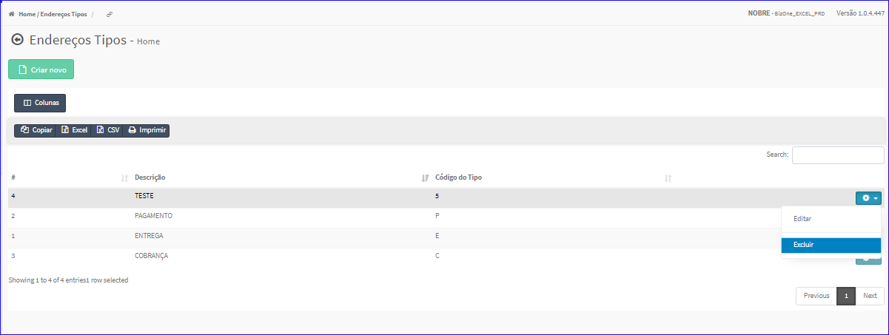
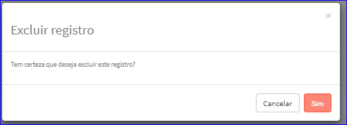

Excluir Endereços Tipos
#######################
- A tela do Cadastro permite efetuar a exclusão de um Tipo de Endereço.
- Para isso, basta selecionar um Tipo da Lista e ir até a Engrenagem situada à direita e escolher a opção **Excluir**.

|imagem8|
   - `Funções da Lista <enderecos_tipos.html#section>`__
   - Após escolhido o Tipo o sistema irá questionar o usuário quanto ao registro.

|imagem9|
   - Depois de clicado em **Sim** o sistema atualizará a lista da tela do cadastro.

