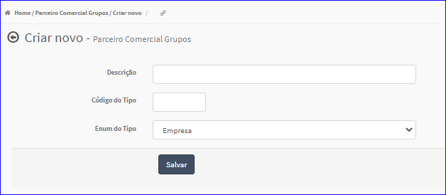
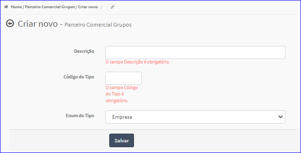

Criar Grupos
############
- Permite gerar um novo Grupo Parceiro Comercial.

- Essa opção é chamada através do botão **Criar Novo** da tela principal do Cadastro de Grupos.

|imagem4|

- Após clicar no botão, o sistema irá abrir uma nova tela para a criação do cadastro.

|imagem2|
   * O sistema valida os dados informados pelo usuário.
   * Caso não forem informados corretamente, são exibidas as mensagens.

|imagem3|
   * Após informado corretamente os dados e clicado em **Salvar**, o sistema automaticamente atualizará a Lista do Cadastro de Grupos.

.. |imagem4| image:: imagens/Grupos_4.png

