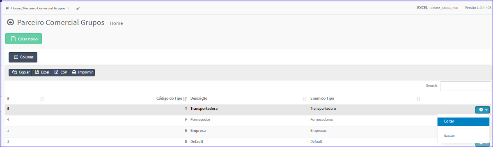
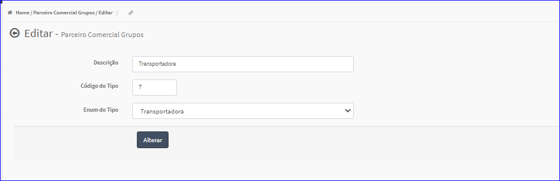

Editar Grupos
#############
- A tela da Edição permite alterar os dados de um Grupo.

- Esta tela é chamada através da Lista dos Grupos exibida na tela principal do Cadastro.
- Para isso, basta selecionar um Grupo da Lista e ir até a Engrenagem situada à direita e escolher a opção **Editar**.

|imagem7|
   - `Funções da Lista <lista_grupo.html#section>`__
   - Após o sistema irá abrir uma nova tela com o Grupo escolhido anteriormente.   

|imagem8|
   - O botão **Alterar** irá atualizar todas as modificações efetuadas.

