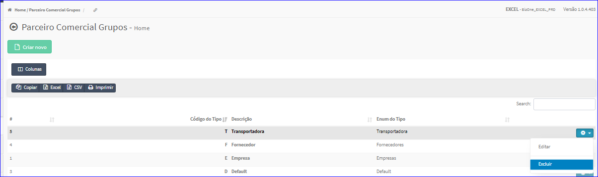
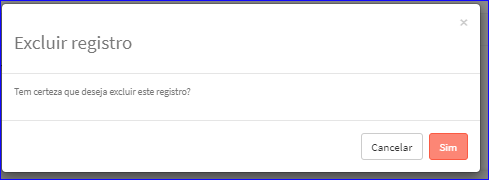

Excluir Grupos
##############
- A tela da Edição permite efetuar a exclusão de um Grupo.
- Para isso, basta selecionar um Grupo da Lista e ir até a Engrenagem situada à direita e escolher a opção **Excluir**.

|imagem9|
   - `Funções da Lista <lista_grupo.html#section>`__
   - Após escolhido o Grupo o sistema irá questionar o usuário quanto ao registro.

|imagem10|
   - Depois de clicado em **Sim** o sistema atualizará a lista da tela do cadastro.

