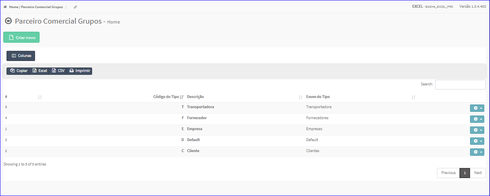

Grupos
######
- No Menu (Superior ou Esquerdo) acesse a opção **Cadastros -> Parceiro Comercial -> Grupos**.
   * O sistema irá apresentar uma tela conforme exemplo.

|imagem1|
   * Tela sem nenhum grupo cadastrado.

|imagem4|
   - Tela com grupos cadastrados.
   - `Funções da Lista <lista_grupo.html#section>`__

.. toctree::
   :maxdepth: 2

   criar_grupo
   editar_grupo
   excluir_grupo

.. |imagem1| image:: imagens/Grupos_1.png

