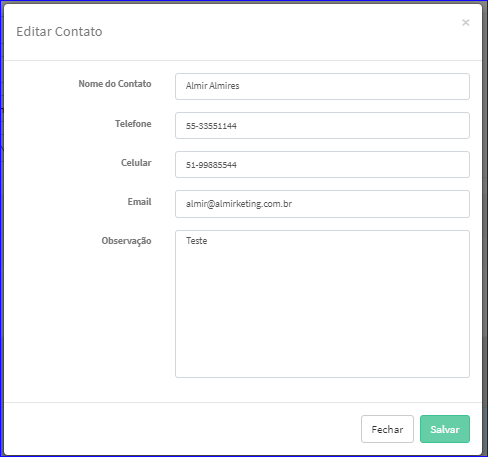

Editar Contato
##############
- A tela da Edição permite alterar os dados de um Contato.
- Esta tela é chamada através da Lista dos Contatos da aba Contatos da tela Editar Parceiro Comercial.
- Para isso, baste selecionar um Contato da Lista e ir até a Engrenagem situada à direita e escolher a opção **Editar**.

|imagem17|
   * Após o sistema irá abrir uma nova tela com o Contato escolhido anteriormente.   

|imagem18|
   * Após as alterações efetuadas e clicado em **Salvar**, o sistema atualizará a Lista de Contatos da tela Editar Parceiro Comercial.

.. |imagem17| image:: imagens/Parceiro_Comercial_17.png

