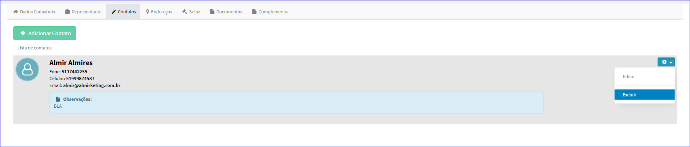
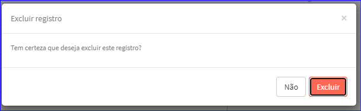

Excluir Contato
###############
- A tela Editar Parceiro Comercial permite excluir um Contato vinculado.

- Para isso, baste selecionar um Contato da Lista e ir até a Engrenagem situada à direita e escolher a opção **Deletar**.

|imagem19|   
- Após escolhido o Contato o sistema irá questionar o usuário quanto ao registro.

|imagem20|
   * Após clicado em **Excluir**, o sistema atualizará a Lista dos Contatos da tela Editar Parceiro Comercial.
   

