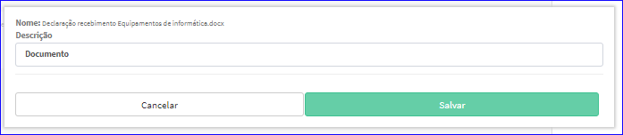

Editar Documentos
#################
- A tela da Edição permite alterar os Documentos vinculados.

- Esta tela é chamada através da Lista dos Documentos da tela Editar Parceiro Comercial.
- Para isso, baste selecionar um Documento da Lista e ir até opção **Editar**.

|imagem41|
   - Após o sistema irá abrir uma nova tela com o Documento escolhido anteriormente.   

|imagem42|
   - Esta tela permite alterar a Descrição do documento.
   - Depois das alterações efetuadas é preciso clicar em **Salvar** e o sistema atualizará a lista da tela Editar Parceiro Comercial.
   
- Após as alterações efetuadas, basta clicar no botão **Salvar** da tela Editar Parceiro Comercial.

.. |imagem41| image:: imagens/Parceiro_Comercial_41.png

