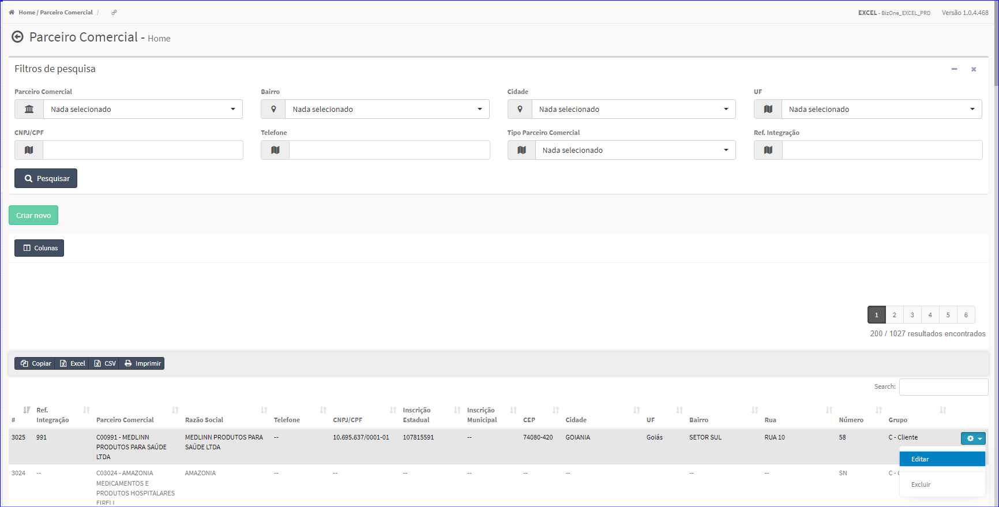

Editar Parceiro Comercial
#########################
- A tela da Edição permite alterar os dados de um Parceiro Comercial.
- Atualiza os Dados Cadastrais, Representante, Contatos, Endereços, Sefaz, Documentos e Dados Complementares.

- Esta tela é chamada através da Lista dos Parceiros Comerciais exibida na tela principal do Cadastro.
- Para isso, basta selecionar um Parceiro Comercial da Lista e ir até a Engrenagem situada à direita e escolher a opção **Editar**.

|imagem5|
   - `Funções da Lista <lista_parceiro_comercial.html#section>`__
   - Após o sistema irá abrir uma nova tela com o Parceiro Comercial escolhido anteriormente.   

|imagem9|
|imagem9b|
   - O botão **Salvar** irá atualizar todas as modificações efetuadas.

- **Dados Cadastrais**
   - Permite informar os dados de Cadastro da Empresa.

|imagem10|
|imagem11|
   
- **Representante**
   - Permite a escolha de um Representante da Empresa.

|imagem12|

- **Complementar**
   - Mostrará os dados Complementares da Empresa.

|imagem45|
   * Permite escolher o Segmento da Empresa e definir cores padrão.

.. toctree::
    :maxdepth: 2

    contatos/contatos
    enderecos/enderecos
    sefaz/sefaz
    documentos/documentos

.. |imagem9| image:: imagens/Parceiro_Comercial_9.png

.. |imagem9b| image:: imagens/Parceiro_Comercial_9b.png

.. |imagem10| image:: imagens/Parceiro_Comercial_10.png

.. |imagem11| image:: imagens/Parceiro_Comercial_11.png

.. |imagem12| image:: imagens/Parceiro_Comercial_12.png

.. |imagem13| image:: imagens/Parceiro_Comercial_13.png

.. |imagem21| image:: imagens/Parceiro_Comercial_21.png

.. |imagem30| image:: imagens/Parceiro_Comercial_30.png

.. |imagem31| image:: imagens/Parceiro_Comercial_31.png

.. |imagem37| image:: imagens/Parceiro_Comercial_37.png

.. |imagem38| image:: imagens/Parceiro_Comercial_38.png

.. |imagem45| image:: imagens/Parceiro_Comercial_45.png
