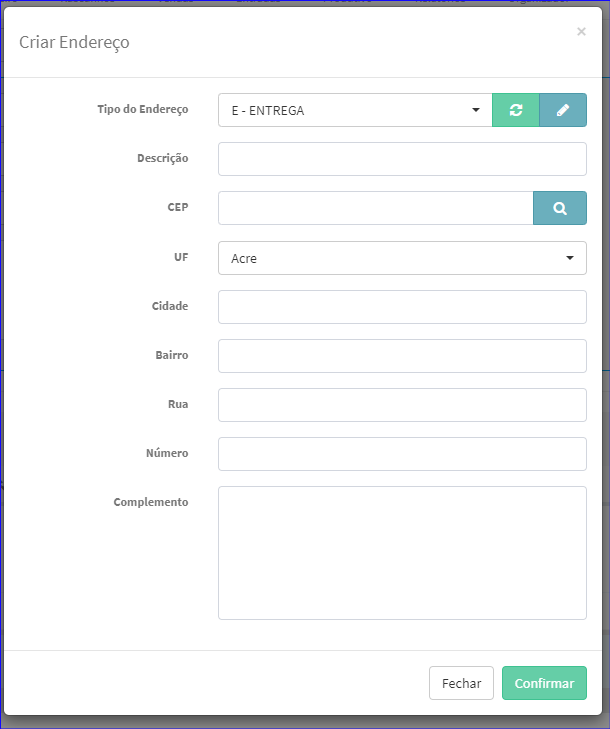

Criar Endereço
##############
- Permite adicionar Endereços ao Parceiro Comercial.

- Essa opção é chamada através do botão **+ Adicionar Endereço** da tela Editar Parceiro Comercial.

|imagem21|

- Após o sistema abrirá uma nova tela para inserir os dados do endereço.

|imagem22|
   * Essa tela permite o usuário informar um Novo Tipo de Endereço.
   * O sistema valida a Descrição do Endereço.
   * Caso não for informado, é exibida a mensagem.
   
  |imagem23|

- Após informado corretamente os dados do Endereço e clicado em **Salvar**, o sistema automaticamente atualizará a Lista dos Endereços.

|imagem24|

- Após as alterações efetuadas, basta clicar no botão **Salvar** da tela Editar Parceiro Comercial.

.. toctree::
    :maxdepth: 2

    enderecos_tipos/enderecos_tipos

.. |imagem21| image:: imagens/Parceiro_Comercial_21.png

.. |imagem23| image:: imagens/Parceiro_Comercial_23.png

.. |imagem24| image:: imagens/Parceiro_Comercial_24.png

.. |imagem50| image:: imagens/Parceiro_Comercial_50.png

.. |imagem51| image:: imagens/Parceiro_Comercial_51.png
