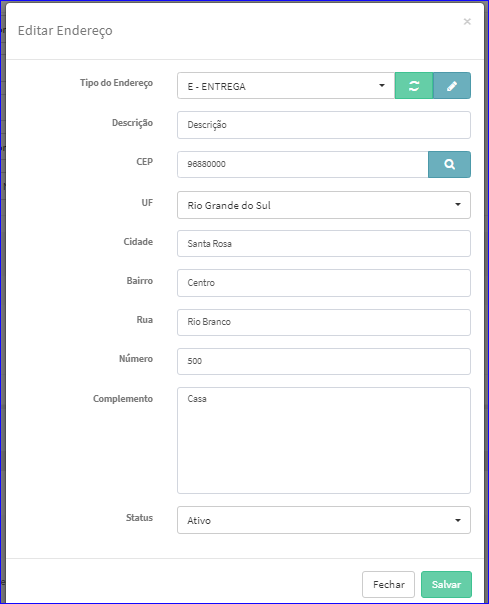

Editar Endereço
###############
- A tela da Edição permite alterar os dados do Endereço.

- Esta tela é chamada através da Lista de Endereços da tela Editar Parceiro Comercial.
- Para isso, baste selecionar um Endereço da Lista e ir até a Engrenagem situada à direita e escolher a opção **Editar**.

|imagem25|
   - Após o sistema irá abrir uma nova tela com o Endereço escolhido anteriormente.   

|imagem26|
 - Depois das alterações efetuadas é preciso clicar em **Salvar** e o sistema atualizará a lista da tela Editar Parceiro Comercial.
 
 - Após as alterações efetuadas, basta clicar no botão **Salvar** da tela Editar Parceiro Comercial.
 

.. toctree::
    :maxdepth: 2

    enderecos_tipos/enderecos_tipos
    
.. |imagem25| image:: imagens/Parceiro_Comercial_25.png

.. |imagem50| image:: imagens/Parceiro_Comercial_50.png

.. |imagem51| image:: imagens/Parceiro_Comercial_51.png
