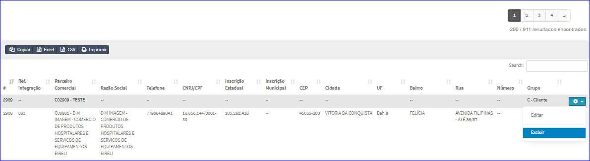

Excluir Parceiro Comercial
##########################
- A tela da Edição permite efetuar a exclusão um Parceiro Comercial.
- Para isso, basta selecionar um Parceiro Comercial da Lista e ir até a Engrenagem situada à direita e escolher a opção **Excluir**.

|imagem6|
   - `Funções da Lista <lista_parceiro_comercial.html#section>`__
   - Após escolhido a Empresa o sistema irá questionar o usuário quanto ao registro.

|imagem20|
   - Depois de clicado em **Deletar** o sistema atualizará a lista da tela Editar Parceiro Comercial.

.. toctree::
    :maxdepth: 2

    contatos
    enderecos
    sefaz
    documentos

.. |imagem20| image:: imagens/Parceiro_Comercial_20.png
