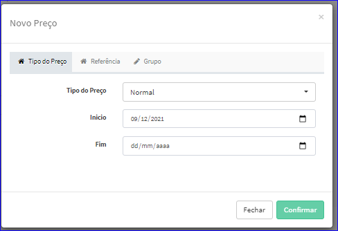
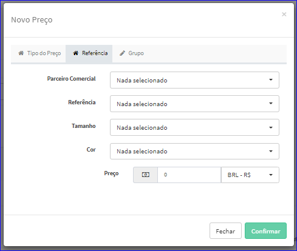
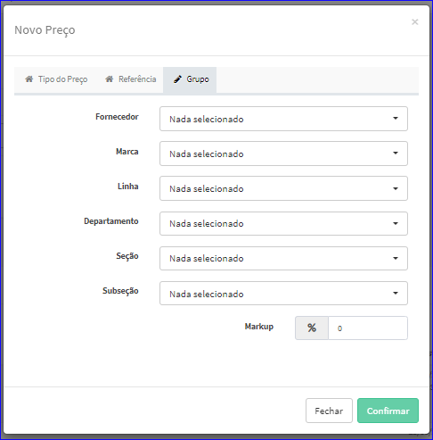
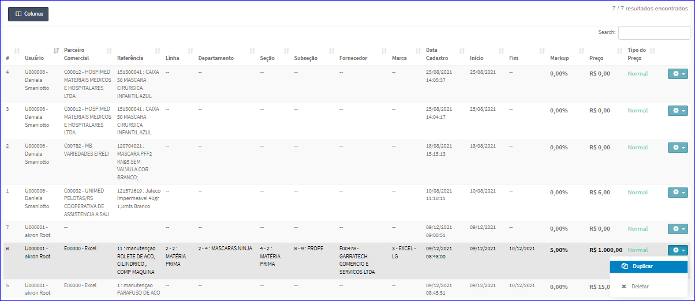

Duplicar Preço
##############
- É chamada através da Lista de Preços exibida na tela principal do Cadastro.
- Para isso, baste selecionar um Preço da Lista e ir até a Engrenagem situada à direita e escolher a opção **Duplicar**.

|imagem9|
   - Após o sistema irá abrir uma nova tela com o Preço escolhido anteriormente.   
   - Nesta tela serão definidos os requisitos para o novo preço.

- **Tipo de Preço**

|imagem5|
   - Tipo de Preço;
   - Validade.

- **Referência**

|imagem6|
   - Parceiro Comercial;
   - Referência;
   - Tamanho;
   - Cor;
   - Preço.
   
- **Grupo**

|imagem7|
   - Fornecedor;
   - Marca;
   - Linha;
   - Departamento;
   - Seção;
   - Subseção;
   - Markup.
   
- Após informado corretamente os dados e clicado em **Confirmar**, o sistema automaticamente atualizará a lista dos Preços.

