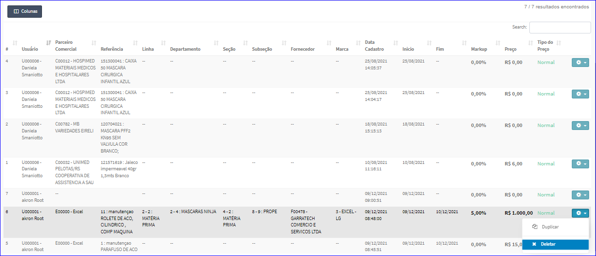
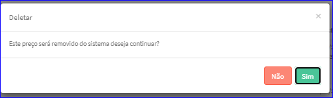

Excluir Preço
#############
- A tela principal do Cadastro permite efetuar a exclusão de um Preço.
- Para isso, baste selecionar um Preço da Lista e ir até a Engrenagem situada à direita e escolher a opção **Deletar**.

|imagem10|
   - `Funções da Lista <lista_precos.html#section>`__
   
- Após o sistema irá questionar o usuário quanto ao registro.

|imagem11|
   - Depois de clicado em **Sim** o sistema atualizará a Lista dos Preços.

