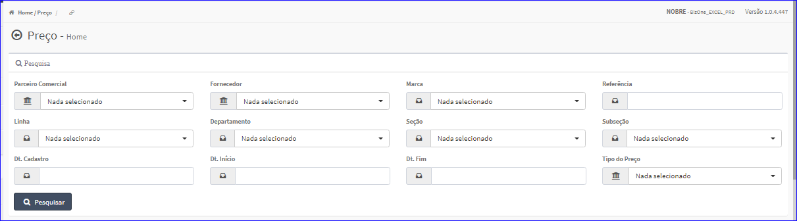
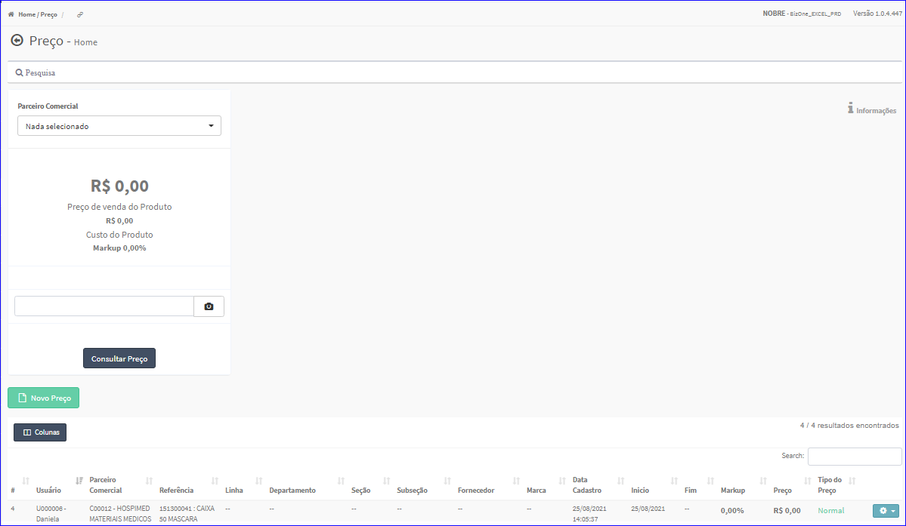

Preços
######
No Menu (Superior ou Esquerdo) acesse a opção **Cadastros -> Preços -> Preços**.
   * O sistema irá apresentar uma tela conforme exemplo abaixo.

|imagem1|
- Esta tela permite efetuar pesquisa utilizando os filtros:
   * Parceiro Comercial;
   * Fornecedor;
   * Marca;
   * Referência;
   * Linha;
   * Departamento;
   * Seção;
   * Subseção;
   * Data Cadastro;
   * Data Início;
   * Data Fim;
   * Tipo do Preço.
   
- Caso o usuário não queira informar nenhum filtro, basta clicar em **Pesquisar**.
   
- Os resultados serão apresentados conforme exemplo.

|imagem2|
   - `Funções da Lista <lista_precos.html#section>`__

.. toctree::
   :maxdepth: 2

   criar_precos
   editar_precos
   excluir_precos

