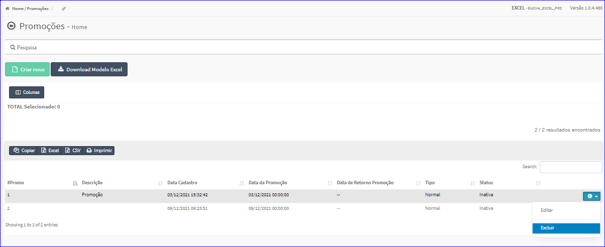
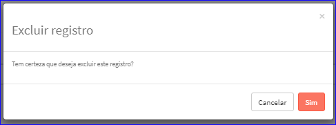

Excluir Promoção
################
- A Exclusão da Promoção somente é permitida na Tela Principal do Cadastro.
- Para isso, baste selecionar uma Promoção da Lista e ir até a Engrenagem situada à direita e escolher a opção **Excluir**.

|imagem21|
   * `Funções da Lista <lista_comissao.html#section>`__
   
- Após o sistema irá questionar o usuário quanto ao registro.

|imagem22|
   - Depois de clicado em **Sim** o sistema atualizará a Lista das Promoções.

