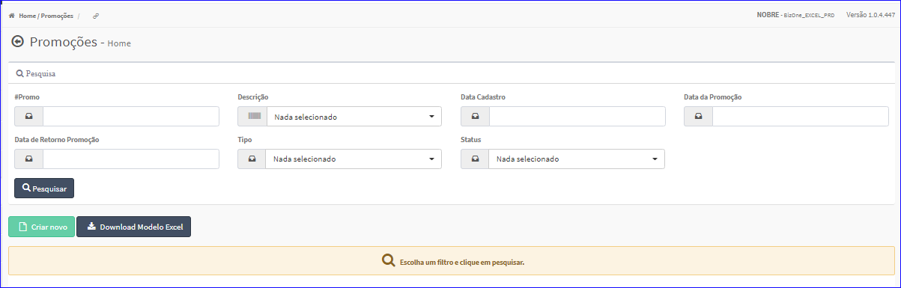

Promoções
#########
No Menu (Superior ou Esquerdo) acesse a opção **Cadastros -> Preços -> Promoções**.
   * O sistema irá apresentar uma tela conforme exemplo abaixo.

|imagem1|
- Esta tela permite efetuar pesquisa utilizando os filtros:
   * Código da Promoção;
   * Descrição;
   * Data Cadastro;
   * Data da promoção;
   * Data de Retorno Promoção;
   * Tipo;
   * Status.
   
- Caso o usuário não queira informar nenhum filtro, basta clicar em **Pesquisar**.
   
- Os resultados serão apresentados conforme exemplo.

|imagem2|
   - `Funções da Lista <lista_promocoes.html#section>`__

.. toctree::
   :maxdepth: 2

   criar_promocoes
   editar_promocoes
   excluir_promocoes
   lista_promocoes

