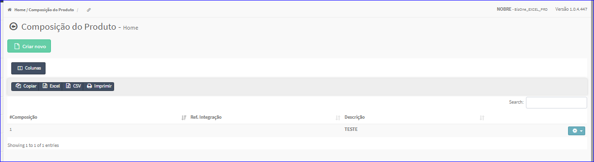

Composição do Produto
#####################
- No Menu (Superior ou Esquerdo) acesse a opção **Produtos -> Composição**.
   * O sistema irá apresentar uma tela conforme exemplo abaixo.

|imagem1|
   - `Funções da Lista <lista_produtos.html#section>`__

.. toctree::
   :maxdepth: 2

   criar_composicao
   editar_composicao
   excluir_composicao

