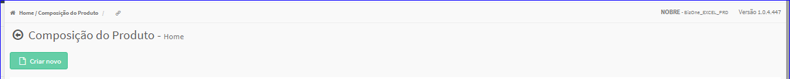

Composição do Produto
#####################
- No Menu (Superior ou Esquerdo) acesse a opção **Produtos -> Composição**.
   * O sistema irá apresentar uma tela conforme exemplo abaixo.

|imagem0|
   * Tela sem nenhuma composição cadastrada.

|imagem1|
   - Tela com composição cadastradas.
   - `Funções da Lista <lista_composicao.html#section>`__

.. toctree::
   :maxdepth: 2

   criar_composicao
   editar_composicao
   excluir_composicao
   lista_composicao

.. |imagem1| image:: imagens/Composicao_1.png
