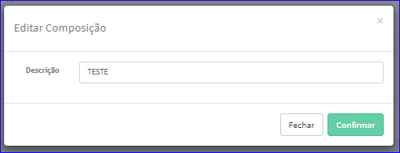

Editar Composição
#################
- A tela da Edição permite alterar os dados de uma Composição.

- Esta tela é chamada através da Lista das Composições exibida na tela principal do Cadastro.
- Para isso, basta selecionar uma Composição da Lista e ir até a Engrenagem situada à direita e escolher a opção **Editar**.

|imagem6|
   - `Funções da Lista <lista_composicao.html#section>`__
   - Após o sistema irá abrir uma nova tela com a Composição escolhida anteriormente.   

|imagem7|
   - O botão **Confirmar** irá atualizar todas as modificações efetuadas.

.. |imagem7| image:: imagens/Composicao_7.png
