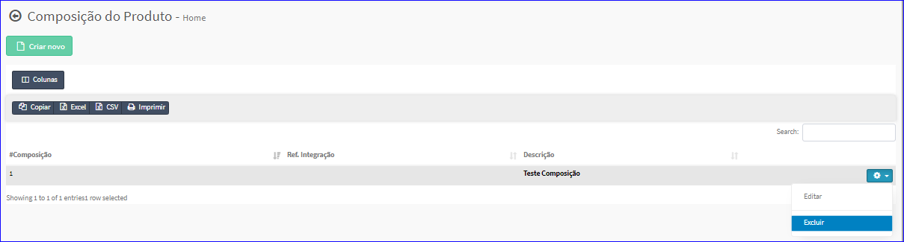
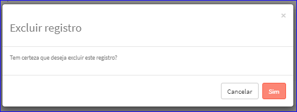

Excluir Composição
##################
- Esta opção é chamada através da Lista das Composições exibida na tela principal do Cadastro.
- Para isso, basta selecionar uma Composição da Lista e ir até a Engrenagem situada à direita e escolher a opção **Excluir**.

|imagem7|
   - `Funções da Lista <lista_composicao.html#section>`__
   - Após escolhido a Composição o sistema irá questionar o usuário quanto ao registro.

|imagem8|
   - Depois de clicado em **Sim** o sistema atualizará a lista.

