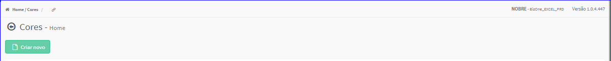

Cor
###
- No Menu (Superior ou Esquerdo) acesse a opção **Cadastros -> Produtos -> Cor**.
   * O sistema irá apresentar uma tela conforme exemplo abaixo.

|imagem0|
   * Tela sem nenhuma cor cadastrada.

|imagem1|
   - Tela com cores cadastradas.
   - `Funções da Lista <lista_cor.html#section>`__

.. toctree::
   :maxdepth: 2

   criar_cor
   editar_cor
   excluir_cor

.. |imagem1| image:: imagens/Cor_1.png
