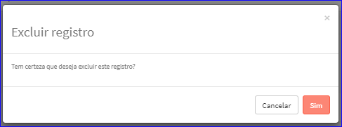

Excluir Cor
###########
- Esta opção é chamada através da Lista das Cores exibida na tela principal do Cadastro.
- Para isso, basta selecionar uma Cor da Lista e ir até a Engrenagem situada à direita e escolher a opção **Excluir**.

|imagem7|
   - `Funções da Lista <lista_cor.html#section>`__
   - Após escolhido a Cor o sistema irá questionar o usuário quanto ao registro.

|imagem8|
   - Depois de clicado em **Sim** o sistema atualizará a lista.

.. |imagem7| image:: imagens/Cor_7.png

