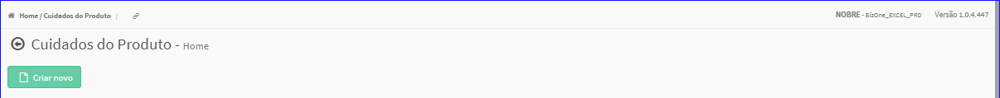

Criar Cuidados
##############
- Permite gerar um novo Cuidado do Produto.

- Essa opção é chamada através do botão **Criar Novo** da tela principal do Cadastro de Cuidados do Produto.

|imagem0|

- Após clicar no botão, o sistema irá abrir uma nova tela para a criação do cadastro.

|imagem4|
   * Após informado corretamente os dados e clicado em **Confirmar**, o sistema voltará para a tela de cadastro e atualizará a lista dos Cuidados.

.. |imagem4| image:: imagens/Cuidados_4.png
