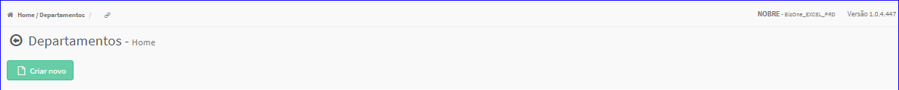

Departamento
############
- No Menu (Superior ou Esquerdo) acesse a opção **Cadastros -> Produtos -> Departamento**.
   * O sistema irá apresentar uma tela conforme exemplo abaixo.

|imagem0|
   * Tela sem nenhum departamento cadastrado.

|imagem1|
   - Tela com departamentos cadastrados.
   - `Funções da Lista <lista_departamento.html#section>`__

.. toctree::
   :maxdepth: 2

   criar_departamento
   editar_departamento
   excluir_departamento

.. |imagem1| image:: imagens/Departamento_1.png
