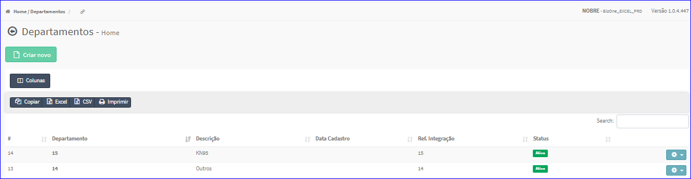

Departamentos
#############
- No Menu (Superior ou Esquerdo) acesse a opção **Produtos -> Departamento**.
   * O sistema irá apresentar uma tela conforme exemplo abaixo.

|imagem1|
   - `Funções da Lista <lista_produtos.html#section>`__

.. toctree::
   :maxdepth: 2

   criar_departamento
   editar_departamento
   excluir_departamento

