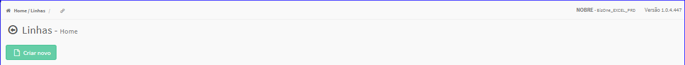
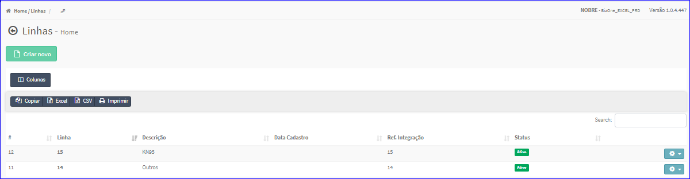

Linha
#####
- No Menu (Superior ou Esquerdo) acesse a opção **Cadastros -> Produtos -> Linha**.
   * O sistema irá apresentar uma tela conforme exemplo abaixo.

|imagem0|
   * Tela sem nenhuma linha cadastrada.

|imagem1|
   - Tela com linhas cadastradas.
   - `Funções da Lista <lista_linha.html#section>`__

.. toctree::
   :maxdepth: 2

   criar_linha
   editar_linha
   excluir_linha

