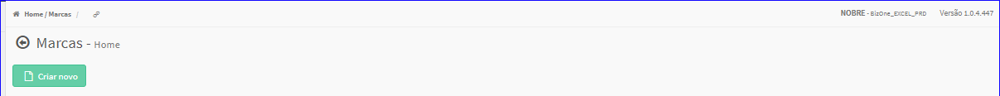
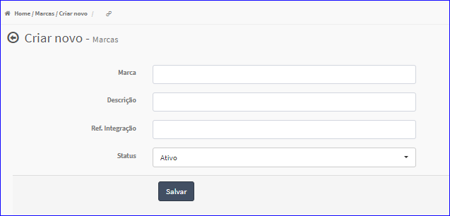
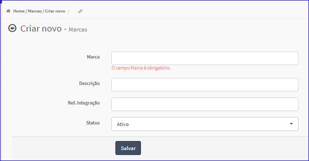

Criar Marca
###########
- Permite gerar uma nova Marca.

- Essa opção é chamada através do botão **Criar Novo** da tela principal do Cadastro de Cores.

|imagem0|

- Após clicar no botão, o sistema irá abrir uma nova tela para a criação do cadastro.

|imagem4|
   
   * Caso o usuário não informar corretamente os dados, o sistema mostrará a mensagem.

|imagem4a|

   * Após informado corretamente os dados e clicado em **Salvar**, o sistema voltará para a tela de cadastro e atualizará a lista das Marcas.   

