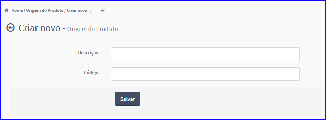
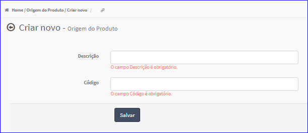

Criar Origem Produto
####################
- Permite gerar uma nova Origem de Produto.

- Essa opção é chamada através do botão **Criar Novo** da tela principal do Cadastro de Origem do Produto.

|imagem0|

- Após clicar no botão, o sistema irá abrir uma nova tela para a criação do cadastro.

|imagem4|
   * Caso o usuário não informar os dados corretamente, o sistema irá mostrar mensagem.

|imagem5|
   * Após informado corretamente os dados e clicado em **Salvar**, o sistema voltará para a tela de cadastro e atualizará a lista das origens.

.. |imagem0| image:: imagens/Origem_Produto_0.png

