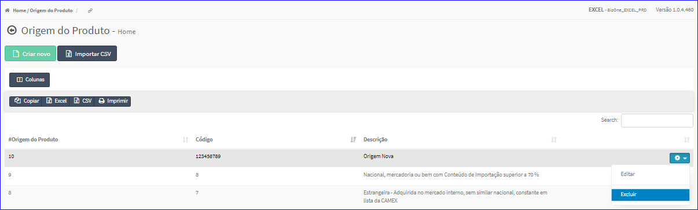
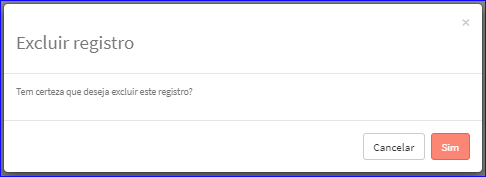

Excluir Origem Produto
######################
- Esta opção é chamada através da Lista das Origens exibida na tela principal do Cadastro.
- Para isso, basta selecionar uma Origem da Lista e ir até a Engrenagem situada à direita e escolher a opção **Excluir**.

|imagem8|
   - `Funções da Lista <lista_origem_produto.html#section>`__
   - Após escolhido a Referência o sistema irá questionar o usuário quanto ao registro.

|imagem9|
   - Depois de clicado em **Sim** o sistema atualizará a lista.

